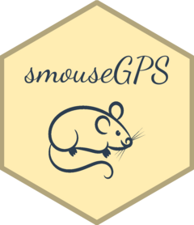

<!-- README.md is generated from README.Rmd. Please edit that file -->

# smouseGPS

<!-- badges: start -->


<!-- badges: end -->

The goal of smouseGPS is to …

## Installation

You can install the development version of smouseGPS like so:

``` r
# FILL THIS IN! HOW CAN PEOPLE INSTALL YOUR DEV PACKAGE?
```

## Example

This is a basic example which shows you how to solve a common problem:

``` r
library(smouseGPS)
## basic example code
```
